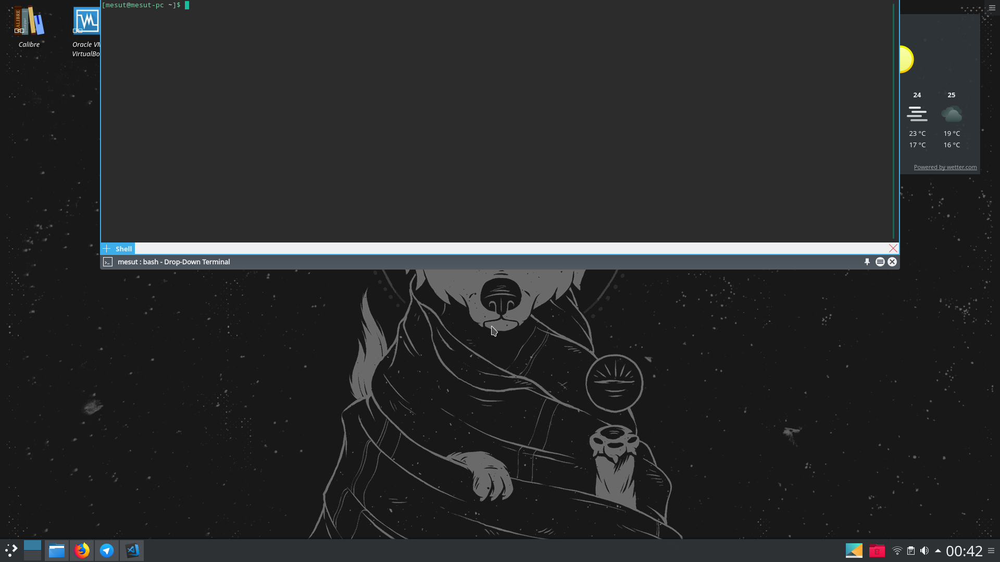
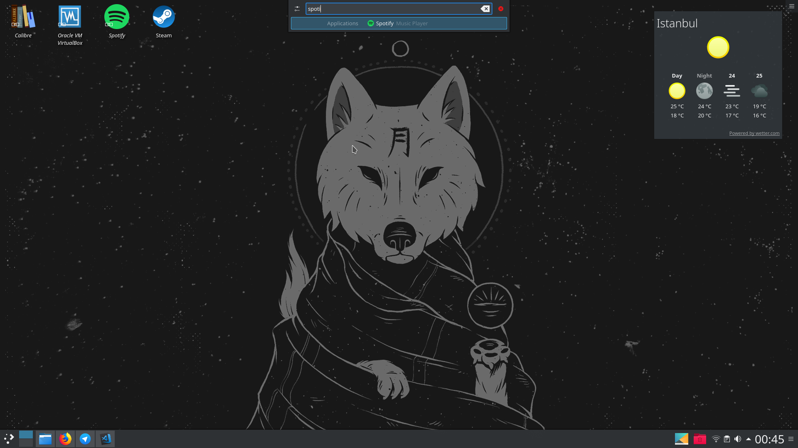
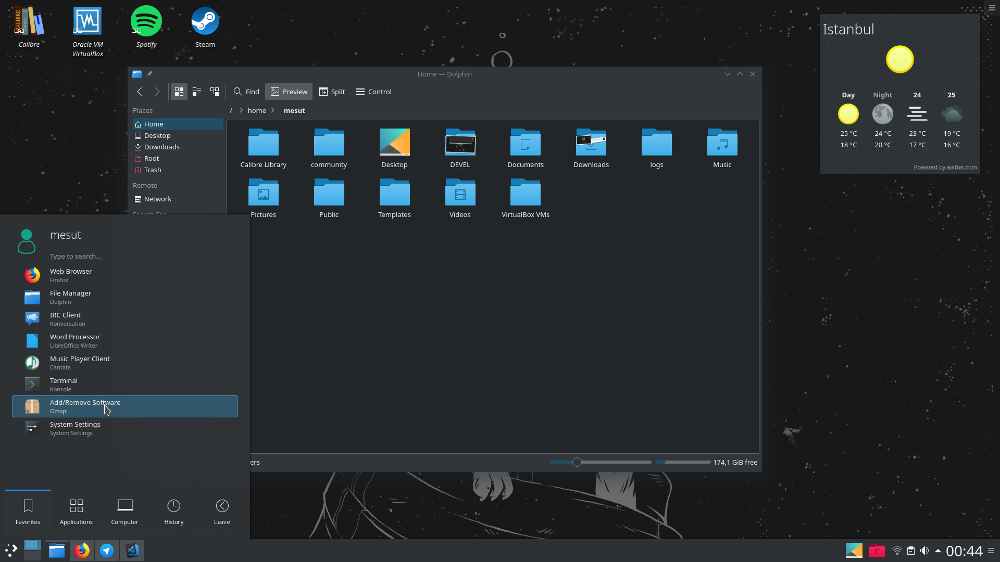

Aslında sorunun cevabı basit: merak. Linux guru veya uzun süreler linux kullanmış biri değilim. Sadece ara ara Fedora, Mint, Ubuntu gibi dağıtımları denedim ancak yolun sonu hep Windows'a çıktı. Manjaro'yla durum biraz daha farklı. Yükleyeli 1 aydan uzun bir süre oldu ve şimdiye kadar önemli bir eksiklik veya yazılım hatasıyla karşılaşmadım.

Aslında macerama sanal makine olarak ne denesem diye başlamıştım. distrowatch'a girdiğimde genelde ilk sırada Mint olurdu. Ancak Manjaro'yu görünce şaşırmıştım. Ne olduğunu araştırınca Arch tabanlı olduğunu görünce üzülmedim desem yalan olur. Daha önce Arch kurmayı deneyip başarılı olamamıştım. İyi ki biraz daha detaylı araştırmışım ki Arch'ın benim de yaşadığım en büyük sorunlarından(bazılarına göre avantaj) birine çözüm getirmiş ve kurmayı kolay hale getirmiş. Hemen GNOME sürümünü indirip kurdum. Aratınca da daha çok GNOME sürümünün resimlerini görünüyordu. Ancak biraz inceledikten sonra bir de KDE'yi denedim ve o zamandan beri KDE'yi kullanıyorum. xcfe'yi şimdiye kadar deneyimleme fırsatı bulmadım ama KDE'den çok memnunum. Aslında KDE'nin görüntüsünü ve kullanımına bayılınca sanal olarak değil tam kurulum yapmak istedim ve hemen tek os olarak Manjaro'nun kurulumuna başladım.

Gelelim Manjaro'ya ve Arch'a. Daha önce de belirttiğim gibi Manjaro Arch üzerine kurulmuş kullanıcı deneyimine ve kullanım kolaylığına önem veren bir distro. [Kendi sitelerinden](https://manjaro.org/) çaldığım Philip Müller'in yorumunun bir kısmı şu şekilde: 
  
```
Manjaro Linux'un kullanıcı kitlesi olarka hem giriş 
seviyesi hem üst seviye kullanıcıları hedefliyor. 
Kullanıcılara hayatlarını kolaylaştıracak arayüz 
araçları ve script'ler sunuyoruz: Manjaro NVIDIA 
Optimus teknolojisi destekli halde yükleniyor.
```
NVIDIA'nın iki anakart arasında duruma göre değişiklik yapmayı sağlayan Optimus teknolojisinin diğer distrolarda önümü kestiği olmuştu. Sürekli NVIDIA kart çalışmaya başlıyor ve fanlar bu sebeple daha çok çalıştığından ses ve ısı seviyesi artabiliyordu. Kurulum bittiği gibi özel ayarlar yapmama gerek bırakmaması önemli bir aantaj oldu.

Arch'ın en sevilen özelliklerinden birisi package manager'ı olan pacman sanırım. Komut satırından bir şeyleri kurmak eğlenceli de olsa Octopi kullanarak aranan çoğu yazılım bulunabiliyor. Resmi repolarda bulunamayan bazı yazılımları kolay yükleyebilmek için ise Arch topluluğunun oluşturmuş olduğu ve derlemeyi kolaylaştıran ayarların bulunduğu AUR(Arch User Repository)'lar bulunuyor.

Octopi veya AUR üzerinde genel olarak her şeyi bulabilsek de [flathub](https://flathub.org) isimli bir projeye denk geldim. Bu proje tüm linux distrolarında kurulumları kolaylaştırmayı amaçlıyor ve her şey çok basitçe kurulabiliyor. Denemediyseniz denemenizi tavsiye ederim popüler çoğu uygulama var. Vscode'u yüklerken işimi epey kolaylaştırdı.

Manjaro'yu yüklediğimizde tam sürüm bir işletim sistemiyle karşılaşıyoruz. Video oynatıcıdan, Libre Office'e, bir işletim sisteminde ihtiyacımız olan çoğu şey yüklü geliyor. Bazıları KDE'nin özellikleri de olsa diğer distrolarda da çoğunu uğraşarak ayarlayabilsek de benim hoşuma giden bazı özellikler şunlar oldu:

  * Octopi sayesinde yazılım yüklemenin, silmenin ve güncellemenin çok basit olması.
  * Kopyala işlemlerimiz saklanıyor ve bir widget sayesinde istersek önceden neler kopyalamışız diye bakabiliyoruz.
  * KDE Connect mobil uygulamasıyla telefonun bilgisayarın touchpad'i olarak kullanılabilmesi. Daha bir çok özelliği var da ben onu kullanıyorum.
  * F12'ye basınca üstten açılan terminal
  
  * ALT + Space' e basınca açılan arama özelliği
  
  * Arayüzden de çoğu ayarların basit bir biçimde değiştirilebilmesi ve bu ayarların özelleştirilebilirliği
  * Breeze Dark gibi temalarla siyah sevenlerin işletim sistemini siyaha çevirebilmesi.
  

Kısaca artık Windows kullanmak istemiyor, yeni bir şeylere her zaman açıksınız, şu Linux'u hep görmek istemiştim diyip sorun yaşamak da istemiyorsanız Manjaro bence şu an seçilebilecek en iyi Linux dağıtımlarından birisi. Linux'ten gözünüz korkuyorsa bile  sorunsuzca kurup kullanabilirsiniz. Daha uzmanlar ise arch linux'un özelleştirilebilirliğinin avantajını Manjaro'da da kullanabilirler. Linux konusunda daha bilgili olmak istiyorsanız da benim de derslerine devam ettiğim [bu şirin siteyi](https://linuxjourney.com) kullanabilirsiniz. 

So Say We All!
