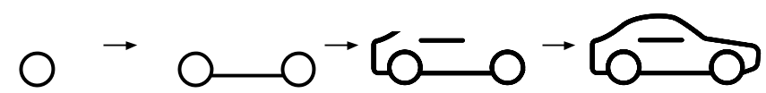
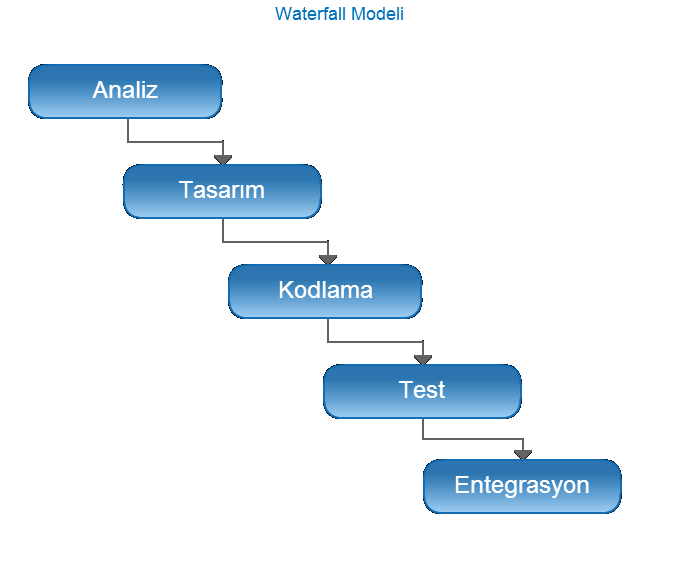
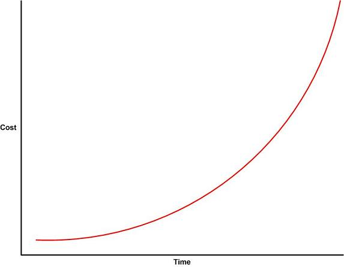
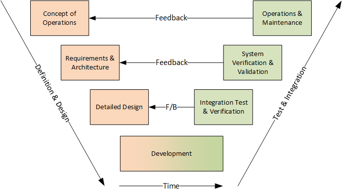
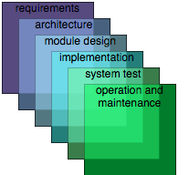

Bu blog yazısında Coursera'da bulunan [Software Development Processes and Methodologies](https://www.coursera.org/learn/software-processes) dersinin 3. haftasının waterfall modelleri başlığındaki konulardan tuttuğum notları ve kendi öğrendiklerimi paylaşacağım. 

## Neden bu kadar çok modele ihtiyacımız var?

Yazılımlar dünyamızda büyük bir yer kaplıyor ve büyüklü küçüklü çok sayıda yazılım projesi yürütülüyor. Bir çok alanda çok farklı içeriklere sahip projeler mevcut. Bunların hepsine uyacak tek bir yazılım geliştirme modeli bulmamız pek olası değil. Bir projeye çok iyi uyan bir model başka bir projede iyi bir çıktı üretmeyebilir. Bu sebeple farklı modelleri öğrenip proje için doğru modeli seçmek projenin başarısı açısından kritik önem taşıyor.

Bu modelleri genelleştirerek sınıflara koyup karşılaştırabiliriz.

## Predictive vs Adaptive Model

**Predictive Model**

Ürün ya da yazılımın gereksinimleri müşteri tarafından kesin bir biçimde bilindiğinde predictive model kullanılabilir. Bu modelde müşteri istediklerinden emin gereksinimler belli. Bunun sonucunda da geliştirme takımı gereksinimleri anlayıp ortaya bir ürün koyuyor. Geliştirme takımı geliştirmeye başalyıp ortaya ürünü çıkarıyor ve tek seferde yazılım ortaya çıkmış oluyor. Geliştirme sırasında değişiklikler istenilen bir şey değil ve ürün projeye başlama sırasındaki gereksinimlere göre geliştiriliyor.

**Adaptive Model**

Bu modelde müşterinin istediği ürün hakkında genel bir fikri var. Ancak bu ürünün nasıl uygulanacağı nasıl bir hal alacağı konusunda kesin hatlar çizemiyor. Bu modelde bir fikirden çıkılarak ürünün küçük bir sürümü oluşturuluyor. Müşterinin ortaya çıkan sürümlere verdiği geri dönüşler neticesinde bir sonraki sürümler geliştiriliyor. Bu sayede ürün müşteriyle birlikte şekillendiriliyor ve değişken bir yapı alabiliyor. Proje bittiğinde başlangıca göre çok farklı bir ürün oluşmuş olabilir.

İlk sınıflandırmamız predictive ve adaptive modeldi. Ancak gerçek dünyada projeler genellikle %100 adaptive veya %100 predictive değildir. 

## Incremental Model vs Iterative Model

**Incremental Model**

Bu modelde ne geliştirileceği biliniyor. Ancak bir kerede geliştirmek yerine ilk sürümün üzerine yeni özellikler ekleyerek geliştirmeye devam ediliyor. Örneğin bir araba üretilecekse önce tekerlekler üretiliyor. Ardından şasesi, direksiyonu vb sırayla eklenip ürün araba haline getiriliyor. Verilen araba örneği incremental model ancak ara süreçler kullanıcı açısından anlamsız. Sadece son ürün kullanıcının işine yarayabilir. Bu model daha çok ara ürünlerin de faydalı olduğu projelerde kullanılıyor. 

**Iterative Model**

Bu modelde bir sorunun çözümünden veya bir fikirden ortaya çıkılıyor. Örneğin A noktasından B noktasına gitme ihtiyacının çözülmesi gerekiyor. Bunun için ilk aşamadan hızlı bir araba ortaya çıkarmak yerine önce bir kaykay sonra scooter sonra bisiklet... araba şeklinde ilerlenebiliyor. Bu sayede ilk aşamada az bir eforla sorun çözülmüş oluyor.

İki modelin farkına değinecek olursak incremental model bir ürün ortaya çıkarıp onu geliştirmek üzerine kuruluyken iterative model varolan ürünü tamamen değiştirip farklı bir yöntem benimseyebilir.

İki modelde de adımların sonunda müşterinin geri dönüşleri dikkate alınırsa ve ürün ona göre geliştirilirse adaptive model olarak kabul edilebilir.

Yazılım geliştirilirken hem incremental hem iterative yöntem de kullanılabilir veya ikisi de kullanılmayabilir.

## Waterfall Model

Yazılım geliştirme süreçlerinin mantıksal bir akış gerçekleştirecek şekilde arka arkaya uygulandığı sürece waterfall model diyoruz. 

İlk önce gereksinimler belirlenip analizler yapılıyor. Ardından tasarımlar tamamlanıyor. Geliştirmesi yapıldıktan sonra testi üretime alınması ve bakım süreçleri işliyor.

Geliştirme aşamasında bir sorun bulduk diyelim. Bu durumda bir önceki sürece gidiliyor  ve geriye dönük bir besleme döngüsü oluşabiliyor. Bulunan sorun analiz aşamasındaysa analiz düzeltiliyor tasarım tekrar yapılıyor ve kodlama aşamasından tekrar devam ediliyor. Burada farkedilecek önemli noktalardan birisi sorun ne kadar geç farkedilirse o kadar maliyetli olacağı. Zamana bağlı olarak aşağıdaki gibi bir maliyet artışı olacaktır.

### Waterfall Başarısı İçin Varsayımlarımız

* Gereksinimleri iyi biliyoruz ve değişmeyecekler.

Bu modelin başarılı olmasını istiyorsak gereksinimlerin değişmeyeceğine ve sağlam temellere dayandığına emin olmalıyız. Çünkü tüm süreçlerin sıkıntısız biçimde ilerlemesini istiyoruz.

* Takımın benzer bir yazılım geliştirme tecrübesi var.

Örneğin takım bir ATM geliştirmesi projesi aldı. Ancak daha önce bir tecrübesi yok. Gereksinimler tam olsa da geliştirme aşamasında sıkıntı çıkaracak bazı tasarımlar yapmış olabilirler. Ancak bunu geliştirme aşamasında ilerleyene kadar farketmeyebilirler.

Bu modelin başarılı olmasını istiyorsak takımın doğru tasarım kararları aldığından emin olmak için benzer tecrübesi olduğuna emin olmalıyız.

* Gereksinimlerden ürüne dönüşüm çok iyi olacak. Tasarımcılar, mimarlar, geliştiriciler, test yapanlar herkes ürünün gereksinimlerini çok iyi anlayacak. 

**Sınıflandırma**

Waterfall model daha önce konuştuklarımızdan predictive model'in tam bir örneği. Gereksinimler tam olmadan projeye başlanamıyor ve her şey proje başlamadan tam ve açık olmalı. 

++ Kolay ve anlaşılır

++ Gereksinimler tam belli olduğu için tahminlemesi başarılı

++ Gereksinimler belirli olduğu için ürünün tüm noktaları önceden düşünülebilir ve ona göre kararlar alınabilir.

-- Değişimlere kapalı

-- İlk sürümün çıkması uzun zaman alıyor.

Gereksinimler belirli ortaya çıkacak ürün daha önce bir çok kez yapılmış bir ürün ise kullanılması faydalı bir modeldir.

## V-Model

V-model waterfall model'e çok benzerlik gösteriyor. Arka arkaya sıralama yerine V şeklinde bükülmüş bir model.

Sol tarafta projenin tanımlanması ve belirlenmesiyle detayları netleştiriliyor.

Sağ tarafta ise sol tarafta karşılık gelen işlemlerin doğrulamaları yapılıyor. Kısaca V-modelde gereksinimler konuşulurken doğrulama ve kabuller hakkında konuşulmaya başlanıyor. Yani test aşamasına daha erken başlanmış oluyor.

**Sınıflandırma**

V-Model de predictive bir model.

++ Muhtemel sorunların ve bulguların erken tespiti
-- Gereksinim aşamasında daha fazla ekstra çalışma gerekiyor.

Gereksinimlerde belirsizlik olduğunda ve erken validasyon önemli olduğunda kullanılabilecek bir model

## Sashimi Model

Sashimi modelin ana fikri farklı süreçlerin birbiriyle iç içe geçmesine izin vermek.

Örneğin gereksinimler üzerinde çalışırken beklemeden tasarım aşamasında da çalışılabileceğini söylüyor. Bir pipe sistemi gibi üretilen her bir parça tamamen bitirmeyi beklemeden sonraki aşamaya iletiliyor.

* Önceki aşama bitmeden sonraki aşama başlayabilir.

**Sınıflandırma**

Sashimi modelde gereksinimler belirlenirken tasarım ilerliyor. Bu tasarımlarda bir şeyler öğrenilir ve gereksinimlerin güncellenmesi gerekebilir. Bu adaptive'liği arttırsa da Sashimi model predictive modele daha yakın.

++ Geliştirme süresini kısaltıyor
++ Bekleme olmaksızın çalışma imkanı

-- Önceki aşama tam olarak bitmediğinden diğer aşamalara geçildiği için tekrar iş çok fazla olabilir.

Kaynak kullanımını efektif hale getirmek ve waterfall modelin süresini kısaltmak için kullanılabilir.

> So Say We All