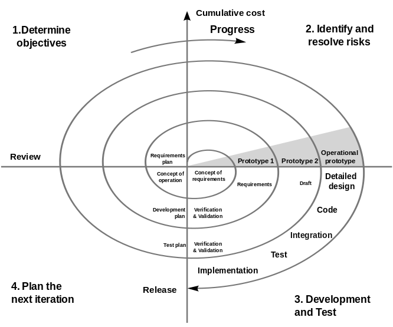

Bu blog yazısında Coursera'da bulunan [Software Development Processes and Methodologies](https://www.coursera.org/learn/software-processes) dersinin 3. haftasının incremental models,iterative models başlığındaki konulardan tuttuğum notları ve kendi öğrendiklerimi paylaşacağım.

## Incremental Model

Incremental modelde waterfall da olduğu gibi gereksinim analizi -> tasarım -> geliştirme -> test -> deployment aşamaları ilerliyor. Her bir süreç sonunda ilerlenmiş olunuyor. Sürece baştan başlanıyor. 

- Birden çok mini waterfall
- Her bir adım üst üste binebilir
- Her adım için farklı bir model kullanılabilir.

++ Kullanıcıya ürünün yarattığı değer daha çabuk ulaştırılıyor.
++ Kullanıcıdan alınan geri bildirimlerle her adımda ürünü iyileştirmek mümkün.

-- Adımlarda tekrarlı işler yapılabilir.

-- Maliyeti arttırabilir.

### Incremental Model Çeşitleri

Çeşitlerden birinde tüm gereksinim analizi en baştan yapılır ve her bir adım tasarım aşamasından başlayarak ilerler.

Başka bir çeşit incremental model de ise requirement ve tasarımdan sonra adımlar ayrılarak ilerlenir.

## Unified Process

Unified process'in en büyük özeti yukarıdaki resim. Y ekseninde gördüğümüz yazılım aşamalarına hangi aşamalarda ne kadar efor vermemiz gerektiğini söylüyor.

### Inception Aşaması

Business case'leri ortaya çıkarıp hedefimiz ne olacak gerçekten ihtiyacımız var mı gibi sorulara cevap aranan aşama. Fizibilite çalışmaları bu aşamada yapılır. 

### Elaboration Aşaması

+ Gereksinimler belirlenir.
+ Use case'ler hazırlanır.
+ Riskler belirlenir.
+ Sistem mimarisi çalışmalarına başlanır. Sistemin temeline ait geliştirmeler yapılır.
+ Proje tahmini daha iyi bir şekilde yapılabilir.

### Construction Aşaması

+ Muhtemelen projenin en uzun aşaması
+ Yazılım geliştirilir. Ortaya çıkarılır.
+ Birden fazla iteration  yapılır. 
Iterative ve incremental'dır. 

### Transition Aşaması

+ Ürün prod ortamına taşınır.
+ Kullanıcıdan geri bildirimleri alınır.
+ İhtiyaç olan conversionlar yapılır ve kullanıcı eğitimleri verilir.

### Unified Process Genel Özellikleri

Unified process denmesine rağmen process'ten çok aslında bir framework. 

Bu framework'ün bir parçası olarak diğer modeller kullanılabilir. Örneğin construction sırasında agile yöntemlerden yararlanılabilir.

Her aşama farklı yazılım süreçlerinden ihtiyaçlar barındırıyor.

Mimariyi öne koyan bir yapı. Elaboration aşamasında iyi bir mimari kullanıldığından emin olmak için önemli bir efor sarf ediliyor.

Adaptive'e daha yakın bir predictive model olarak konumlandırılabilir.

++ Adaptive

++ Kalite ve tekrar kullanılabilirlik.

++ Risklere odaklanıyor ve başarı şansını arttırıyor.

++ Esnek

-- Karmaşık

-- Kaynak ihtiyacı fazla

-- Küçük projeler için çok fazla iş.

* Büyük projelerde kullanmak için uygun.
* Kullanıcıya değeri bir an önce sunmak istiyor.
* Projenin başlarında tüm gereksinimler bilinmiyor.

En popüler Unified Process çeşitlerinden birisi Rational Unified Process (RUP). RUP 9 farklı disiplinden 6 best practice ve araçlardan (IBM RUP) oluşuyor.

OPEN UP and Agile UP de daha basit Unified Process çeşitleri.

## Spiral Model

Spiral model yazılım geliştirme modellerine farklı bir yaklaşım getiriyor. Spiral model riski ön planda tutan bir yazılım geliştirme modeli.

Diğerlerinden farklı olarak resimde de görülebildiği gibi dairesel bir yaklaşım.

Spiralin her bir periyodunda farklı adımlar var.

İlk adım olarak hedefler belirleniyor. Ardından riskler belirleniyor ve çözülüyor. 3. Adımda geliştirme, testler yapılıyor ve son adımda gelecek periyot planlanıyor.

### 1. Aşama Hedefleri Belirlemek

İçinde bulunulan periyotun ihtiyaçları belirleniyor. Paydaşlarla toplantılar düzenleniyor. O periyot içerisindeki kısıtlar ve engeller belirleniyor.

### 2. Aşama Riskleri Belirlemek Ve Çözüme Kavuşturmak

Bu aşamada riskler belirleniyor ve onlarla ilgili yapılması gerekenler inceleniyor. Örneğin bir prototip geliştirerek yazılım geliştirmedeki bir riskin önüne geçilebilir. Bu sayede farklı alternatifler de değerlendirilebilir.

### 3. Aşama Geliştirme ve Test

1. Aşamada belirlenen hedefleri gerçekleştirmek için çalışmalar yapılır. Dizayn, kodlama, test bu aşamada gerçekleştirilir.

### 4. Aşama Planlama

Yapılanlar ve yapılacaklar gözden geçirilir. Gelecek periyot planlanır. Devam edilip edilmeyeceği kararları verilir. Devam edilecekse sıradaki periyoda geçilir.

Adaptive model'e predictive'e göre daha yakın. Spiral in her periyodunda değişikliklere açık.

++ Adaptive

++ Risklere odaklanıyor.

++ Farklı bir model kullanımına esnek

++ Devam/Yeter seçeneği sunuyor.

-- Karmaşık
-- Yönetmesi zor
-- Paydaşların katılımı gerekiyor.

Çok yüksek riskli projelerde kullanıma uygun.
