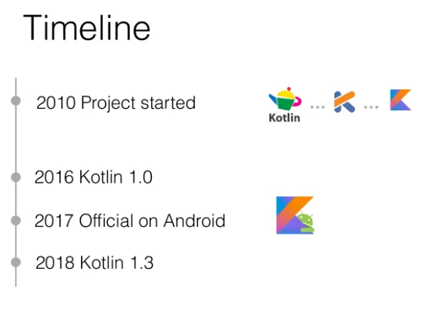

Pragmatic Programmer'ı okurken (Chapter 1-5 Your Knowledge Portfolio) verdiği hedeflerden bazılarını uygulamaya karar vermiştim. Bunlardan birisi yılın her çeyreğinde en az 1 teknik kitap okumaktı. Ne kadar teknik tartışılır ama ilk çeyrekte Coders At Work'u okudum. Sırada ise Robert c. Martin'in Clean Code'u var. Yazarların tavsiyelerinden bir diğeri ise her yıl en az yeni bir dil öğrenmekti. Bu yazı da aslında başlıktan da anlaşıldığı gibi 2. tavsiye hakkında. Yazarların yeni diller yeni paradigmalar öğrenmeyi tavsiyesinin en önemli etkeni yeni dil öğrenmenin bakış açımızı değiştirmeye olanak sağlaması.

Ben de bu sene içerisinde temellerini ve bakış açısını öğrenmem gereken dillerden biri olarak Kotlin'i belirledim. Bu süreçte de öğrendiklerimi paylaşmanın keyif verici olacağını düşünüyorum.

### Neden Kotlin'i Seçtim?

Kotlin'i ilk olarak öğrenciyken katıldığım bir GDG etkinliğinde duymuştum. Kotlin'in 1.0 sürümü yeni çıkmıştı ve Android uygulama geliştirmede nasıl kullanılabileceğinden ve dilin temel özelliklerinden bahsediliyordu. Büyülenip de bunu öğrenmeliyim dediğimi hatırlamıyorum. Öğrenmeye de o gün ucundan da olsa hatırladığım bilgilerle başlıyorum.

Google'ın Kotlin'i Android'in resmi dillerinden biri olarak duyurması ve [2018 yılı StackOverflow anketine](https://insights.stackoverflow.com/survey/2018/#most-loved-dreaded-and-wanted) göre geliştiriciler tarafından en çok 2. sevilen dil olması (1. Rust) Kotlin'i seçmemdeki en önemli motivasyonlardan. Spring ve Java'yla birlikte çalışabilirliği de cabası. 

### Peki Kotlin Tam Olarak Ne?

* Hem fonksiyonel programlama hem nesneye yönelik programlama(OOP) yaklaşımlarını destekleyen her amaca uygun olmayı hedefleyen bir yazılım dili. 

* Jetbrains ve dilin çevresinde büyüyen toplulukla birlikte geliştirilen açık kaynak kodlu(Apache 2.0 Lisanslı) bir proje.

* Kotlin'in en önemli özelliklerinden birisi Java'yla birlikte/iç içe çalışabilmesi. Bu özelliği sayesinde de yeni bir dil olmasına rağmen Java'nın oluşturmuş olduğu devasa ekosistemden faydalanabiliyor.

* Kotlin'in sunmayı planladığı özelliklerden en önemlisi de geliştirici araçları desteği. Arkasında Jetbrains gibi bir firma olunca insan doğal olarak inanıyor.

Android Kotlin için çok önemli bir platform ve popülerliğinin büyük bölümü de onun sayesinde. Ancak ben Kotlin'i öncelikle Android özelinde öğrenmektense kendi genel yapısını öğrenmeyi ardından da Spring ve Android üzerinde nasıl avantajlar sağladığını görmek istiyorum.

Kotlin'in hedefinde ise sadece Android veya backend'de çalışmaktan daha fazlası var. Kotlin kodu Javascript veya Native koda da compile edilebiliyormuş.

Kotlin'in ulaşmak istediği tablo ise aşağıdaki gibi:

#### Kaynakça

Üstte paylaştığım görselleri ve bilgileri Jetbrains tarafından hazırlanan [şu kurstan](https://www.coursera.org/learn/kotlin-for-java-developers) aldım. 

Bir diğer kaynak ise bol bol kullanmam gerekeceğini düşündüğüm [reference](https://kotlinlang.org/docs/reference).

Pragmatic Programmer ile ilgili chapter'ın tamamını tabii ki kitaptan özetini ise [Hugo Matilla'dan](https://github.com/HugoMatilla/The-Pragmatic-Programmer#5-your-knowledge-portfolio) inceleyebilirsiniz.

> [So Say We All!](https://www.youtube.com/watch?v=B3EzRAgjo_s)